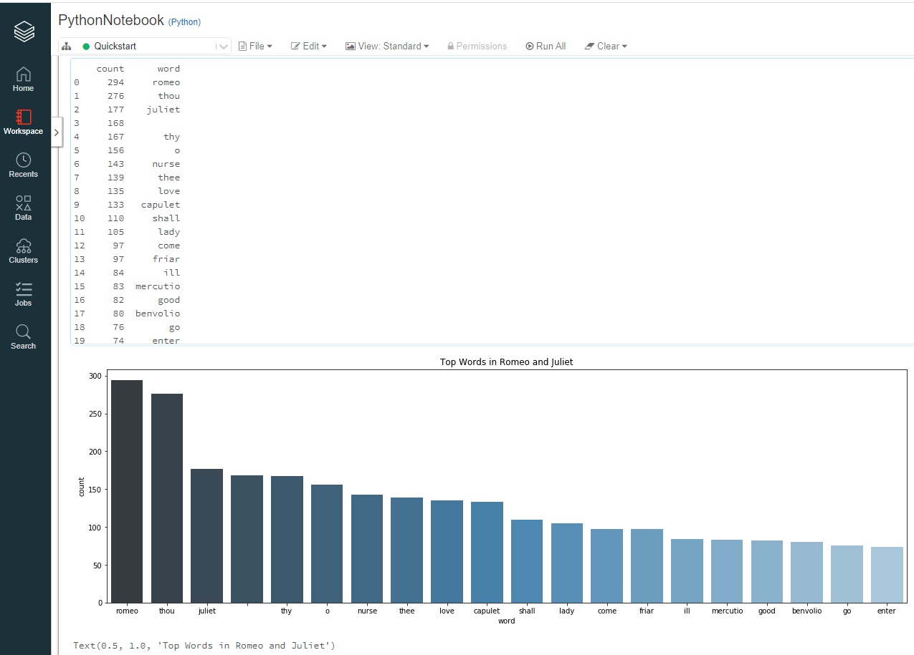

# Challenge -  Improve the Process

## Goals

1. flat map each line to words, cast to lower (case) before strip and split
1. clean out non-letters
1. clean out stopwords
1. map to intermediate key-value pairs (word, 1)
1. reduce by key (sum)
1. map again - reverse so count is first
1. take the top n words by key (first in the tuple)
1. print the summary top N list, e.g., print(topList)
1. chart results with matplotlib and seaborn
    1.    words on x-axis
    1.    ct on y-axis 
    1.    if you switch k-v order above, remember to update the chart
    1.    figsize - double each dimension

## Expected Result

